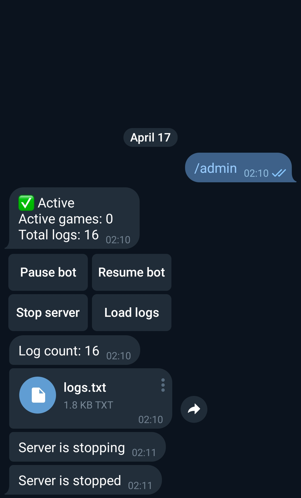

## about

BrightGames is a simple Telegram game bot.  
(dev branch: bot)

### Current features

Avaliable games:  
1. "Memory" (supports multiple difficulty levels)  
2. ["Halma"](https://en.wikipedia.org/wiki/Halma) (multiplayer)  

Use command /games or /start to open the main menu. 

 

#### Admin tools

Admin user has the ability to use /admin command. Options:
1. Pause/resume bot
2. Stop bot server
3. Load bot logs



### Installation

It's possible to use any bot to start BrightGames. The easiest way is to run docker container:
```
docker pull axhse/bright-games-bot:1.0
docker run -d -e BOT_TOKEN= -e ADMIN_USER_ID= bot01 axhse/bright-games-bot:1.0
```
BOT_TOKEN must be specified. ADMIN_USER_ID setting is optional. You can also override other environment variables same way.

### Possible future updates:

1. More games
2. Game rating and player settings saving.
